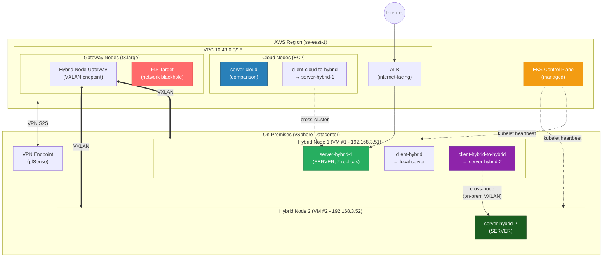
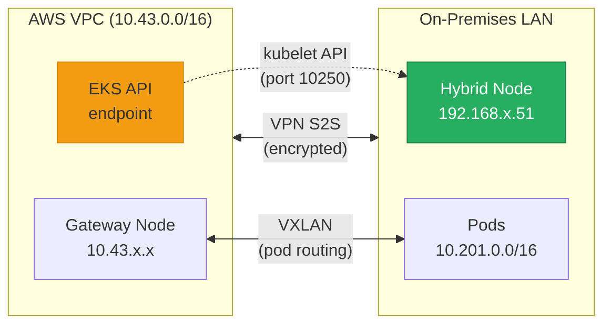

# EKS Hybrid Nodes - Resilience Demo

> Hands-on demonstration of workload resilience on EKS Hybrid Nodes during network disconnection scenarios between AWS and on-premises environments.

## Overview

This demo validates that workloads running on **EKS Hybrid Nodes** (on-premises) continue operating during network connectivity loss with the AWS region, using:

- **Kubernetes Tolerations** to prevent pod eviction during disconnection
- **AWS Fault Injection Service (FIS)** for controlled, auditable chaos engineering
- **vCenter/Hypervisor** interface toggle for visual, immediate network disruption
- **Application Load Balancer (ALB)** to validate ingress/egress traffic flows

## Architecture



### Network Topology



## Pod Naming Convention

All pod names are designed so that `kubectl get pods` immediately tells you WHERE it runs and WHAT it does:

| Pod Name | Location | Role | Calls |
|----------|----------|------|-------|
| **server-hybrid-1** | Hybrid Node 1 (on-prem) | Server | - |
| **server-hybrid-2** | Hybrid Node 2 (on-prem) | Server | - |
| **server-cloud** | Amazon EKS (AWS Region) | Server | - |
| **client-hybrid** | Hybrid Node 1 (on-prem) | Client | → server-hybrid-1 (local) |
| **client-hybrid-to-hybrid** | Hybrid Node 1 (on-prem) | Client | → server-hybrid-2 (cross-node) |
| **client-cloud-to-hybrid** | Amazon EKS (AWS Region) | Client | → server-hybrid-1 (cross-cluster) |

Pattern: `{role}-{location}[-to-{target}]`

```bash
# What you see during the demo:
$ kubectl get pods -n demo-stone -o wide
NAME                              READY  STATUS   NODE
server-hybrid-1-xxxxx             1/1    Running  mi-0xxx... (HYBRID Node 1)
server-hybrid-1-yyyyy             1/1    Running  mi-0xxx... (HYBRID Node 1)
server-hybrid-2-xxxxx             1/1    Running  mi-0yyy... (HYBRID Node 2)
server-cloud-xxxxx                1/1    Running  ip-10-43.. (EKS Region)
server-cloud-yyyyy                1/1    Running  ip-10-43.. (EKS Region)
client-hybrid-xxxxx               1/1    Running  mi-0xxx... (HYBRID Node 1)
client-hybrid-to-hybrid-xxxxx     1/1    Running  mi-0xxx... (HYBRID Node 1)
client-cloud-to-hybrid-xxxxx      1/1    Running  ip-10-43.. (EKS Region)
```

## Demo Scenarios

| # | Scenario | Fault Method | Expected Outcome | What It Proves |
|---|----------|--------------|------------------|----------------|
| 1 | Steady-state disconnect | FIS (disrupt-connectivity on cluster subnets) | Existing pods continue serving requests. Node transitions to NotReady after ~40s. Tolerations prevent eviction. | **"DC doesn't stop if AWS goes down"** |
| 1b | Multi-node on-prem communication | FIS (same as 1) | Pod on Hybrid Node 1 → Pod on Hybrid Node 2 continues working | **Production-like: microservices distributed across DC nodes** |
| 2 | Disconnect during provisioning | FIS + `kubectl scale` | New pods remain Pending (kube-api unreachable). Existing pods unaffected. | Known limitation - transparent trade-off |
| 3a | LB Region → Hybrid Nodes | ALB + curl | External traffic reaches on-prem pods via VXLAN tunnel | Ingress path validation (region-originated) |
| 3b | Hybrid Nodes → External | `kubectl exec` + curl | On-prem pods access external APIs | Egress path validation |
| 3c | LB On-Premises (MetalLB VIP) | curl to LAN VIP during disconnect | On-prem VIP keeps serving during disconnection | **Local entry point independent of AWS** (analogous to F5 design) |
| 4 | Node restart DURING disconnect | vCenter VM restart while FIS active | Pods do NOT restart until reconnection (kubelet needs API server at startup) | Worst-case limitation + why multi-node replicas matter |
| 4b | Static pod after offline restart | Same as 4 | Static pod restarts from local disk, but LB/Service routing to it does not | The exception that proves the rule - not a substitute for multi-node replicas |

---

## Layer Model

| Layer | Contents | Lifecycle |
|-------|----------|-----------|
| Long-lived lab infra | EKS cluster, VPC, TGW + Site-to-Site VPN, Gateway Nodes, hybrid node VMs (vSphere) | Persistent - never torn down between runs |
| Demo infra (Terraform) | FIS role, managed prefix list, FIS experiment template, CloudWatch log group | `terraform apply/destroy` per demo cycle |
| Demo workloads (manifests) | servers (hybrid-1/2, cloud), clients (local/cross-node/cross-cluster), ALB ingress, MetalLB VIP, static pod, burst-app | `kubectl apply` / `99-cleanup.sh` |
| Live "knobs" | FIS start-experiment, iptables block, kubectl scale | Triggered live during the demo |

## Why This Maps to the Customer Use Case

the customer's a plataforma IDP (Kubernetes-based IDP) must run in the Chicago and Atlanta
datacenters with a hard requirement: **if AWS goes down, the datacenter must not
stop**. This demo maps directly:

- **Scenario 1/1b (disconnect resilience)** = the core requirement. Workloads on-prem
  keep serving, including cross-node communication within the DC, when the AWS
  link is lost.
- **Scenario 3c (MetalLB VIP)** = analogous to the customer's planned NodePort + F5 static
  entry point. The local LB keeps serving with zero AWS dependency.
- **Scenario 2/4 (limitations)** = transparent about what does NOT work (new
  scheduling during disconnect, node restart offline), with the mitigation:
  pre-sized multi-node replicas.
- **Cloud bursting (overflow)** = the elasticity story: baseline in the DC, burst
  to AWS on load spikes.

---

## Prerequisites

- AWS CLI v2 configured with credentials for the target account
- `kubectl` configured to access the EKS cluster
- Terraform >= 1.5
- Helm 3
- On-premises VM/bare metal with network connectivity to AWS (VPN or Direct Connect)

---

## Setup

### Path A: New Cluster (I don't have an EKS cluster with Hybrid Nodes yet)

<details>
<summary><b>Click to expand - Create an EKS cluster with Hybrid Nodes via eksctl</b></summary>

#### Step 1: Create the cluster with remote networking

```bash
cat <<'EOF' > cluster-config.yaml
apiVersion: eksctl.io/v1alpha5
kind: ClusterConfig

metadata:
  name: hybrid-resilience-demo
  region: sa-east-1
  version: "1.35"

# Enable Hybrid Nodes remote networking
remoteNetworkConfig:
  remoteNodeNetworks:
    - cidrs:
        - "192.168.3.0/24"   # Your on-premises node CIDR
  remotePodNetworks:
    - cidrs:
        - "10.201.0.0/16"    # CIDR for pods on hybrid nodes

managedNodeGroups:
  # Gateway Nodes - VXLAN endpoints for Hybrid Node Gateway
  - name: gateway-nodes
    instanceType: t3.large
    desiredCapacity: 2
    minSize: 2
    maxSize: 3
    labels:
      hybrid-gateway-node: "true"
    taints:
      - key: hybrid-gateway-node
        effect: NoSchedule

  # General-purpose cloud nodes
  - name: cloud-nodes
    instanceType: m6i.large
    desiredCapacity: 2
    minSize: 1
    maxSize: 4
EOF

eksctl create cluster -f cluster-config.yaml
```

#### Step 2: Install Cilium CNI

Hybrid Nodes require Cilium or Calico (VPC CNI doesn't support remote nodes).

```bash
helm repo add cilium https://helm.cilium.io/
helm install cilium cilium/cilium \
  --namespace kube-system \
  --set egressMasqueradeInterfaces=eth0 \
  --set routingMode=native \
  --set ipv4NativeRoutingCIDR="10.201.0.0/16" \
  --set tunnel=disabled \
  --set ipam.mode=cluster-pool \
  --set ipam.operator.clusterPoolIPv4PodCIDRList="{10.201.0.0/16}"
```

#### Step 3: Install Hybrid Node Gateway

The Gateway provides VXLAN tunneling for pod-to-pod communication between cloud and on-premises.

```bash
# Get your VPC route table IDs
RTB_IDS=$(aws ec2 describe-route-tables \
  --filters "Name=vpc-id,Values=$(aws eks describe-cluster \
    --name hybrid-resilience-demo --query 'cluster.resourcesVpcConfig.vpcId' --output text)" \
  --query 'RouteTables[].RouteTableId' --output text | tr '\t' ',')

helm install eks-hybrid-nodes-gateway \
  oci://public.ecr.aws/eks/eks-hybrid-nodes-gateway \
  --version 1.0.0 \
  --namespace eks-hybrid-nodes-gateway \
  --create-namespace \
  --set vpcCIDR="<YOUR_VPC_CIDR>" \
  --set podCIDRs="10.201.0.0/16" \
  --set routeTableIDs="${RTB_IDS}" \
  --set nodeSelector."hybrid-gateway-node"="true" \
  --set 'tolerations[0].key=hybrid-gateway-node' \
  --set 'tolerations[0].operator=Exists' \
  --set 'tolerations[0].effect=NoSchedule'
```

#### Step 4: Install AWS Load Balancer Controller

```bash
helm repo add eks https://aws.github.io/eks-charts
helm install aws-load-balancer-controller eks/aws-load-balancer-controller \
  --namespace kube-system \
  --set clusterName=hybrid-resilience-demo \
  --set region=sa-east-1 \
  --set vpcId=<YOUR_VPC_ID>
```

#### Step 5: Register the Hybrid Node

On the on-premises VM, install and configure `nodeadm`:

```bash
# 1. Create SSM Hybrid Activation (from your workstation)
aws ssm create-activation \
  --iam-role <HYBRID_NODE_ROLE_NAME> \
  --registration-limit 5 \
  --default-instance-name "hybrid-node" \
  --region sa-east-1

# 2. On the VM: install nodeadm
curl -Lo /usr/local/bin/nodeadm \
  "https://hybrid-assets.eks.amazonaws.com/releases/latest/bin/linux/amd64/nodeadm"
chmod +x /usr/local/bin/nodeadm

# 3. On the VM: create node config
cat <<EOF > /etc/nodeadm/nodeConfig.yaml
apiVersion: node.eks.aws/v1alpha1
kind: NodeConfig
spec:
  cluster:
    name: hybrid-resilience-demo
    region: sa-east-1
  hybrid:
    ssm:
      activationId: "<ACTIVATION_ID>"
      activationCode: "<ACTIVATION_CODE>"
EOF

# 4. On the VM: join the cluster
sudo nodeadm init --config /etc/nodeadm/nodeConfig.yaml
```

</details>

---

### Path B: Existing Cluster (I already have EKS with Hybrid Nodes)

#### Step 1: Configure kubectl

```bash
aws eks update-kubeconfig --name <CLUSTER_NAME> --region <REGION>
```

#### Step 2: Validate cluster state

```bash
# Check nodes - hybrid node should show with compute-type=hybrid
kubectl get nodes -o wide

# Verify hybrid node label
kubectl get nodes -l eks.amazonaws.com/compute-type=hybrid

# Verify Gateway is running
kubectl get pods -n eks-hybrid-nodes-gateway

# Verify AWS LB Controller
kubectl get pods -n kube-system -l app.kubernetes.io/name=aws-load-balancer-controller
```

#### Step 3: Run prerequisites check

```bash
chmod +x scripts/00-prerequisites.sh
./scripts/00-prerequisites.sh
```

---

## Deploy the Demo

### Step 1: Provision FIS Infrastructure (Terraform)

```bash
cd terraform/

# Initialize
terraform init

# Review what will be created
terraform plan \
  -var="cluster_name=<CLUSTER_NAME>" \
  -var="region=<REGION>" \
  -var="onprem_node_cidr=192.168.3.0/24" \
  -var="remote_pod_cidr=10.201.0.0/16"

# Apply
terraform apply \
  -var="cluster_name=<CLUSTER_NAME>" \
  -var="region=<REGION>" \
  -var="onprem_node_cidr=192.168.3.0/24" \
  -var="remote_pod_cidr=10.201.0.0/16"

# Note the outputs:
#   fis_experiment_template_id = "EXTxxxxxxxxxx"
#   ssm_document_name = "demo-stone-network-blackhole-cidr"
```

### Step 2: Label the Hybrid Nodes (REQUIRED before deploying)

The manifests use `nodeSelector: hybrid-node-id` to pin pods to specific nodes. Label BEFORE deploying:

```bash
# List your hybrid nodes
kubectl get nodes -l eks.amazonaws.com/compute-type=hybrid

# Label them (adjust node names)
kubectl label node <FIRST_HYBRID_NODE> hybrid-node-id=node1
kubectl label node <SECOND_HYBRID_NODE> hybrid-node-id=node2
```

### Step 3: Deploy Servers and Clients

```bash
# Deploy all servers
kubectl apply -f manifests/01-server-hybrid-1.yaml   # On-prem Node 1 (creates namespace)
kubectl apply -f manifests/02-server-hybrid-2.yaml   # On-prem Node 2
kubectl apply -f manifests/03-server-cloud.yaml      # AWS cloud

# Deploy all clients (3 communication paths)
kubectl apply -f manifests/04-clients.yaml

# Verify everything is running
kubectl get pods -n demo-stone -o wide
```

### Step 4: Create ALB Ingress

```bash
# Deploy the ALB ingress
kubectl apply -f manifests/05-ingress-alb.yaml

# Wait for ALB to provision (~2-3 minutes)
echo "Waiting for ALB..."
kubectl wait --for=jsonpath='{.status.loadBalancer.ingress[0].hostname}' \
  ingress/demo-ingress -n demo-stone --timeout=180s

# Get the ALB DNS
ALB=$(kubectl get ingress demo-ingress -n demo-stone \
  -o jsonpath='{.status.loadBalancer.ingress[0].hostname}')
echo "ALB ready: http://${ALB}/"

# Test it
curl -s "http://${ALB}/" | jq '{hostname, message}'
```

> **Dry-run validation note:** ALB with `target-type: ip` registers the remote pod IPs (10.201.x.x) as targets. This requires the VPC route tables to have routes to the RemotePodNetwork (handled by the Hybrid Nodes Gateway) and the target group health checks to pass over that path. Validate target health before the customer call: `aws elbv2 describe-target-health --target-group-arn <TG_ARN>`.

### Provisioning the Second Hybrid Node (if you only have one)

The cross-node test requires TWO hybrid nodes. Create a **NEW VM** in vCenter - do NOT clone the existing one:

```bash
# Why NOT clone: the existing VM has SSM agent identity (mi-XXXX) and nodeadm
# state configured for the cluster. Cloning duplicates that identity, causing
# conflicts. A fresh VM gets its own mi-YYYYY identity and a clean nodeadm init.

# 1. Create a fresh Ubuntu 24.04 VM in vCenter (same network, same datastore)
# 2. Assign a different IP in the same subnet (e.g., 192.168.3.52)
# 3. Install nodeadm:
curl -Lo /usr/local/bin/nodeadm \
  "https://hybrid-assets.eks.amazonaws.com/releases/latest/bin/linux/amd64/nodeadm"
chmod +x /usr/local/bin/nodeadm

# 4. Create a NEW SSM Hybrid Activation (or reuse if registration-limit allows)
aws ssm create-activation \
  --iam-role <HYBRID_NODE_ROLE_NAME> \
  --registration-limit 2 \
  --region <REGION>

# 5. On the VM: sudo nodeadm init --config nodeConfig.yaml
# 6. Wait for it to join:
kubectl get nodes -l eks.amazonaws.com/compute-type=hybrid
```

**Pod topology with 2 hybrid nodes:**

```
┌─ Hybrid Node 1 (vSphere VM #1, 192.168.3.51) ─────────────────────────────┐
│                                                                             │
│  [server-hybrid-1]        ← SERVER (2 replicas)                             │
│  [client-hybrid]          ← CLIENT → server-hybrid-1 (local, same node)     │
│  [client-hybrid-to-hybrid]← CLIENT → server-hybrid-2 (cross-node, Node 2)  │
│                                                                             │
└─────────────────────────────────────────────────────────────────────────────┘
            │                                    ▲
            │        Cilium VXLAN (on-prem)       │
            ▼                                    │
┌─ Hybrid Node 2 (vSphere VM #2, 192.168.3.52) ─────────────────────────────┐
│                                                                             │
│  [server-hybrid-2]        ← SERVER (target for cross-node test)             │
│                                                                             │
└─────────────────────────────────────────────────────────────────────────────┘

┌─ Amazon EKS (AWS Region) ──────────────────────────────────────────────────┐
│                                                                             │
│  [server-cloud]           ← SERVER (comparison)                             │
│  [client-cloud-to-hybrid] ← CLIENT → server-hybrid-1 (cross-cluster)       │
│                                                                             │
└─────────────────────────────────────────────────────────────────────────────┘
```

### Step 4b: Install MetalLB (On-Premises LB for Scenario 3c)

MetalLB provides the local VIP in the on-prem LAN - the AWS-validated pattern for LB stability during disconnections (free, no trial expiry, no extra VM needed).

```bash
# Install MetalLB with tolerations to survive disconnect
helm repo add metallb https://metallb.github.io/metallb
helm repo update
helm install metallb metallb/metallb \
  --namespace metallb-system --create-namespace \
  --set 'speaker.tolerations[0].key=node.kubernetes.io/unreachable' \
  --set 'speaker.tolerations[0].operator=Exists' \
  --set 'speaker.tolerations[0].effect=NoExecute'

# Wait for MetalLB pods
kubectl wait --for=condition=ready pod -l app.kubernetes.io/name=metallb \
  -n metallb-system --timeout=120s

# Apply the IP pool + L2 advertisement + LoadBalancer service
# IMPORTANT: edit the IP range in the manifest first (must be FREE IPs in your LAN)
kubectl apply -f manifests/06-metallb-onprem-lb.yaml

# Verify the VIP was assigned
kubectl get svc server-hybrid-lb -n demo-stone
# EXTERNAL-IP should show an IP from the pool (e.g., 192.168.3.240)

# Test from the on-prem LAN
curl -s http://192.168.3.240/ | jq '{hostname, message}'
```

### Step 5: Run the Demo

```bash
chmod +x scripts/demo-live.sh
./scripts/demo-live.sh
```

---

## Execution Guide (Step-by-Step for Live Demo)

> This section documents exactly what happens during the demo, with commentary
> for presenting to the customer. The interactive script (`scripts/demo-live.sh`)
> automates these steps with pauses for explanation.

### Phase 1: Show Current State (5 min)

**What to show the customer:**

1. **Nodes in the cluster** - point out the hybrid node (different hostname pattern `mi-xxxx`, different OS, different IP range):
   ```bash
   kubectl get nodes -o wide
   ```

2. **Pods running on BOTH sides** - color-coded (green = on-prem, blue = cloud):
   ```bash
   kubectl get pods -n demo-stone -o wide
   ```

3. **Tolerations configured** - explain WHY they exist:
   ```bash
   kubectl get deploy server-hybrid-1 -n demo-stone -o yaml | grep -A 10 tolerations
   ```

4. **Key talking point:**
   > "These tolerations tell Kubernetes: even if this node becomes unreachable,
   > do NOT evict the pods. They should keep running indefinitely (or for N hours).
   > Without this, Kubernetes would evict pods after 5 minutes by default."

---

### Phase 2: LB Tests - Happy Path (10 min)

#### 2a. Region → Hybrid Nodes (Ingress)

**What to show:**

```bash
# External traffic reaches the on-prem pods
ALB=$(kubectl get ingress demo-ingress -n demo-stone -o jsonpath='{.status.loadBalancer.ingress[0].hostname}')

# Single request - note the "message" field showing it's the hybrid pod
curl -s "http://${ALB}/" | jq '{hostname, message, color}'

# Multiple requests - show distribution
for i in $(seq 1 5); do
  echo "Request $i: $(curl -s http://${ALB}/ | jq -r '.hostname')"
done
```

**Talking point:**
> "Traffic from the internet hits the ALB in the AWS region,
> which routes to the pod running on-premises via the VXLAN tunnel.
> This validates your ingress path works end-to-end."

#### 2b. Hybrid Nodes → External (Egress)

**What to show:**

```bash
# Pod on-prem calling an external API
kubectl exec -n demo-stone deploy/server-hybrid-1 -- curl -s httpbin.org/ip

# Pod on-prem calling a service in the cloud (cross-cluster)
kubectl exec -n demo-stone deploy/server-hybrid-1 -- \
  curl -s http://server-cloud.demo-stone:9898/ | jq '{hostname, message}'
```

**Talking point:**
> "Pods on-prem can reach external APIs and also communicate
> with pods in the cloud region. Bidirectional connectivity is working."

---

### Phase 3: Disconnect - Steady State (10 min)

**This is the core of the demo.**

#### Step 1: Open three terminals with client logs (side by side)

```bash
# Terminal 1: LOCAL client (Node 1 → Node 1)
kubectl logs -n demo-stone deploy/client-hybrid -f

# Terminal 2: CROSS-NODE client (Node 1 → Node 2, on-prem mesh)
kubectl logs -n demo-stone deploy/client-hybrid-to-hybrid -f

# Terminal 3: CROSS-CLUSTER client (Cloud → Node 1, over VPN)
kubectl logs -n demo-stone deploy/client-cloud-to-hybrid -f
```

All show 200 before disconnect. The contrast AFTER disconnect is the proof.

#### Step 2: Start the FIS experiment

```bash
# Option A: FIS (recommended - shows the AWS service)
FIS_TEMPLATE_ID="<from terraform output>"
aws fis start-experiment \
  --experiment-template-id ${FIS_TEMPLATE_ID} \
  --region sa-east-1

# Option B: vCenter (visual fallback)
# In vCenter UI: VM → Edit Settings → Network Adapter 1 → Disconnect
```

#### Step 3: Watch the contrast across all three clients

After ~40 seconds, the customer sees:

```
# Terminal 1 (client-hybrid - LOCAL, same node):
[09:20:10] #120 LOCAL → server-hybrid-1 | 200 ✓
[09:20:15] #121 LOCAL → server-hybrid-1 | 200 ✓     ← UNINTERRUPTED
[09:20:20] #122 LOCAL → server-hybrid-1 | 200 ✓

# Terminal 2 (client-hybrid-to-hybrid - CROSS-NODE, Node1→Node2):
[09:20:10] #120 CROSS-NODE → server-hybrid-2 | 200 ✓
[09:20:15] #121 CROSS-NODE → server-hybrid-2 | 200 ✓     ← ALSO UNINTERRUPTED
[09:20:20] #122 CROSS-NODE → server-hybrid-2 | 200 ✓

# Terminal 3 (client-cloud-to-hybrid - CROSS-CLUSTER, Cloud→OnPrem):
[09:20:10] #120 CROSS-CLUSTER → server-hybrid-1 | 200 ✓
[09:20:15] #121 CROSS-CLUSTER → server-hybrid-1 | TIMEOUT ✗   ← EXPECTED
[09:20:20] #122 CROSS-CLUSTER → server-hybrid-1 | TIMEOUT ✗
```

#### Step 4: Show node status

```bash
# Node is NotReady (no heartbeat to control plane)
kubectl get nodes -l eks.amazonaws.com/compute-type=hybrid
# NAME                    STATUS     ROLES   AGE
# mi-0ee2ff775b4369c29    NotReady   <none>  40d

# BUT pods remain Running (tolerations prevent eviction)
kubectl get pods -n demo-stone -l tier=hybrid -o wide
# server-hybrid-1-xxxxx   1/1   Running   mi-0ee2ff775b4369c29
# server-hybrid-1-xxxxx   1/1   Running   mi-0ee2ff775b4369c29
# client-hybrid-xxxxx    1/1   Running   mi-0ee2ff775b4369c29
```

**Key talking points:**
- **client-hybrid (local):** STATUS=200 continuously - pods PROCESS requests without interruption
- **client-cloud (cross-cluster):** TIMEOUT - expected because the VXLAN tunnel traverses the broken link
- This proves exactly what the customer needs: **workloads on-premises continue operating even if AWS connectivity is lost**
- The cross-cluster path failing is expected and acceptable - the DATACENTER is independent
- Pod-to-pod on the same node uses Cilium eBPF datapath (kernel-level, no control plane dependency)

---

### Phase 3b: Multi-Node On-Premises Communication During Disconnect (5 min)

**The production scenario: microservices distributed across multiple DC nodes.**

#### Step 1: Show cross-node client (Hybrid Node 1 → Hybrid Node 2)

```bash
# This client runs on Node 1 and calls a server on Node 2
# Both are on-premises, communication via Cilium VXLAN over the local LAN
kubectl logs -n demo-stone deploy/client-hybrid-to-hybrid --tail=5
```

**What the customer sees:**

```
# DURING AWS DISCONNECT:
[09:22:10] #150 CROSS-NODE → server-hybrid-2 | 200 ✓
[09:22:15] #151 CROSS-NODE → server-hybrid-2 | 200 ✓
[09:22:20] #152 CROSS-NODE → server-hybrid-2 | 200 ✓
```

#### Step 2: Summary of all THREE communication paths

```bash
echo "=== LOCAL (Node 1 → Node 1): ==="
kubectl logs -n demo-stone deploy/client-hybrid --tail=2

echo "=== CROSS-NODE (Node 1 → Node 2, on-prem): ==="
kubectl logs -n demo-stone deploy/client-hybrid-to-hybrid --tail=2

echo "=== CROSS-CLUSTER (Cloud → Node 1, over VPN): ==="
kubectl logs -n demo-stone deploy/client-cloud-to-hybrid --tail=2
```

**Expected results during disconnect:**

| Path | Status | Why |
|------|--------|-----|
| client-hybrid (same node) | ✓ STATUS=200 | Cilium eBPF datapath, local |
| client-hybrid-to-hybrid (Node 1 → Node 2) | ✓ STATUS=200 | Cilium VXLAN over local LAN, independent of AWS |
| client-cloud (Cloud → Node 1) | ✗ TIMEOUT | Path traverses the broken VPN link |

**Key talking point:**
> "This is the production scenario. Your microservices will be distributed
> across multiple nodes in the datacenter. This test proves that
> even cross-node communication within the DC continues working
> during an AWS disconnection. The Cilium overlay mesh between
> on-premises nodes is LOCAL - it doesn't depend on the control plane.
> Only the initial setup needs the control plane. Once running,
> the datapath is autonomous."

---

### Phase 3c: On-Premises Load Balancer During Disconnect (5 min)

**Validates the customer's production entry-point design: a static VIP in the DC (analogous to F5 + NodePort), fully independent of AWS.**

MetalLB (L2 mode) provides a LoadBalancer VIP in the on-premises LAN. This is the AWS-documented validated pattern: *"MetalLB in L2 mode remains stable during network disconnections between hybrid nodes and the EKS control plane"* ([source](https://docs.aws.amazon.com/eks/latest/best-practices/hybrid-nodes-network-disconnection-best-practices.html)).

#### Step 1: Show the on-prem VIP

```bash
kubectl get svc server-hybrid-lb -n demo-stone
# NAME               TYPE           EXTERNAL-IP     PORT(S)
# server-hybrid-lb   LoadBalancer   192.168.3.240   80:3xxxx/TCP
```

#### Step 2: Access via the VIP from the on-prem LAN (still disconnected from AWS)

```bash
# From any machine on the on-premises network (or from the hybrid node itself):
curl -s http://192.168.3.240/ | jq '{hostname, message}'
# Response comes from server-hybrid-1 - NO AWS involved in this path
```

#### Step 3: Prove it works during disconnect

While the FIS experiment is active (or vCenter NIC disconnected from AWS path):

```bash
# The VIP keeps responding - this path never touches AWS
for i in $(seq 1 5); do
  curl -s -o /dev/null -w "Request $i: HTTP %{http_code}\n" http://192.168.3.240/
done
# Request 1: HTTP 200
# Request 2: HTTP 200
# ...
```

**Key talking points:**
- This VIP is the DC's local entry point - the same role F5 plays in the production design
- ARP-based L2 announcement: zero dependency on control plane or AWS connectivity
- MetalLB speaker has tolerations to survive the disconnect (same pattern as the app pods)
- In production, replace MetalLB with F5 + NodePort + Gateway API as planned; the concept demonstrated is identical: local traffic stays local

---

### Phase 4: Node Restart DURING Disconnect - Worst Case (5 min)

**The "what if it gets worse?" scenario: a node power-cycles while disconnected from AWS.**

> Documented behavior: [EKS Best Practices - Pod Failover, Scenario 5](https://docs.aws.amazon.com/eks/latest/best-practices/hybrid-nodes-kubernetes-pod-failover.html)

#### Step 1: With FIS still active (network disconnected), restart Hybrid Node 2 in vCenter

```bash
# In vCenter: VM #2 → Power → Restart Guest OS
# (use Node 2 so the primary demo pods on Node 1 stay untouched)
```

#### Step 2: Observe - pods on Node 2 do NOT come back

```bash
kubectl logs -n demo-stone deploy/client-hybrid-to-hybrid --tail=5
# [10:35:10] #300 CROSS-NODE → server-hybrid-2 | TIMEOUT ✗   ← Node 2 restarted,
# [10:35:15] #301 CROSS-NODE → server-hybrid-2 | TIMEOUT ✗     pod did NOT restart
```

**Why:** on startup, the kubelet queries the API server to learn which pods it should run. Without connectivity, it cannot retrieve that information - so pods stay down until reconnection. Not even `crictl` can restart them manually (containerd removes failed pods rather than restarting).

#### Step 3: Show that the app SURVIVES thanks to multi-node replicas

```bash
# server-hybrid-1 on Node 1 (NOT restarted) keeps serving:
kubectl logs -n demo-stone deploy/client-hybrid --tail=3
# [10:35:20] #302 LOCAL → server-hybrid-1 | 200 ✓   ← still processing

# And the on-prem VIP still works (it targets Node 1 pods):
curl -s -o /dev/null -w "HTTP %{http_code}\n" http://192.168.3.240/
# HTTP 200
```

#### Step 4: Reconnect and watch Node 2 recover

```bash
# Stop FIS (or wait for auto-revert). Node 2 reconnects, kubelet syncs
# with the API server, and pods restart automatically.
kubectl logs -n demo-stone deploy/client-hybrid-to-hybrid --tail=3
# [10:40:15] #360 CROSS-NODE → server-hybrid-2 | 200 ✓   ← recovered
```

**Key talking points:**
- This is the WORST-CASE combo: node failure + network disconnection simultaneously
- Pods on the restarted node stay down until reconnection - **this is why replica count and multi-node distribution matter**
- The app survived because replicas exist on the OTHER node (exactly the pattern we recommend: N+1/N+2 across nodes)
- Static pods are the only workload the kubelet can start offline, but they are NOT recommended for applications - multi-node replicas are the right mitigation
- For a plataforma IDP: distribute critical services across at least 2-3 nodes per DC

#### Phase 4b (bonus): Static Pod - the exception that proves the rule

A static pod placed on Node 2 (see `manifests/07-static-pod-node2.yaml` for setup) demonstrates the ONE workload type that survives an offline restart:

```bash
# After Node 2 restarts (still disconnected from AWS):

# 1. The static pod CAME BACK - kubelet reads it from local disk, no API server needed.
#    Access it DIRECTLY via node IP + hostPort:
curl -s http://192.168.3.52:8080/ | jq '{hostname, message}'
# {"hostname": "static-web", "message": "STATIC POD (kubelet-managed, survives offline restart)"}

# 2. BUT it does NOT respond via the MetalLB VIP or any ClusterIP Service:
#    - MetalLB speaker (DaemonSet) did not restart (needs API server)
#    - kube-proxy (DaemonSet) did not restart (Service routing broken on that node)
#    Only DIRECT node-IP access works.
```

**The complete picture after an offline node restart:**

| Workload on restarted node | Comes back? | Reachable via |
|---------------------------|-------------|---------------|
| Deployment pods (server-hybrid-2) | ✗ No (kubelet needs API server) | - |
| MetalLB speaker (DaemonSet) | ✗ No | - |
| kube-proxy (DaemonSet) | ✗ No | - |
| **Static pod** | ✓ Yes (local disk manifest) | Node IP + hostPort ONLY |

**Key talking point:**
> "Static pods survive an offline restart, but everything AROUND them
> (Service routing, LB announcement) doesn't. That's why AWS docs don't
> recommend static pods for applications. The right answer for a plataforma IDP
> is what we showed in Scenario 4: replicas distributed across nodes,
> so a node loss during disconnect never takes the app down."

---

### Phase 5: Disconnect During Provisioning (10 min)

**While still disconnected. client-hybrid still logging 200s.**

#### Step 1: Show both clients (client-hybrid still 200, client-cloud still TIMEOUT)

```bash
echo "=== LOCAL (hybrid→hybrid): still processing ==="
kubectl logs -n demo-stone deploy/client-hybrid --tail=3

echo "=== CROSS-CLUSTER (cloud→hybrid): still broken (expected) ==="
kubectl logs -n demo-stone deploy/client-cloud-to-hybrid --tail=3
```

#### Step 2: Attempt to scale

```bash
# Try to add 2 more replicas
kubectl scale deploy server-hybrid-1 -n demo-stone --replicas=4
```

#### Step 3: Observe the result (wait 15 seconds)

```bash
kubectl get pods -n demo-stone -l location=hybrid -o wide
# NAME                              READY  STATUS   NODE
# server-hybrid-1-xxxxx             1/1    Running  mi-0ee2ff... (existing)
# server-hybrid-1-yyyyy             1/1    Running  mi-0ee2ff... (existing)
# server-hybrid-1-zzzzz             0/1    Pending  <none>       (NEW, can't schedule)
# server-hybrid-1-wwwww             0/1    Pending  <none>       (NEW, can't schedule)
# client-hybrid-xxxxx               1/1    Running  mi-0ee2ff... (still processing!)
# client-hybrid-to-hybrid-xxxxx     1/1    Running  mi-0ee2ff... (still processing!)
```

#### Step 4: Prove existing pods still process

```bash
# client-hybrid STILL getting 200s throughout
kubectl logs -n demo-stone deploy/client-hybrid --tail=3
# [09:25:10] #180 LOCAL → server-hybrid-1 | 200 ✓
# [09:25:15] #181 LOCAL → server-hybrid-1 | 200 ✓
# [09:25:20] #182 LOCAL → server-hybrid-1 | 200 ✓
```

**Key talking points:**
- Existing pods (2 Running + client-hybrid): **still actively processing** (proven by logs)
- New pods: Pending - scheduler can't reach the hybrid node
- This is a **control plane limitation**, NOT a workload limitation
- Mitigation: pre-size replicas for expected disconnection load (N+1 or N+2)
- The continuous logs are undeniable proof that existing work is uninterrupted

---

### Phase 6: Recovery (5 min)

```bash
# Stop FIS experiment (auto-stops after duration), OR
# Reconnect the network adapter in vCenter

# Watch recovery in both client terminals:
# Terminal 1 (client-hybrid): was 200 throughout, stays 200
# Terminal 2 (client-cloud): was TIMEOUT, transitions back to 200
```

**What the customer sees in client-cloud terminal (the "aha" moment):**

```
[09:30:15] #240 CROSS-CLUSTER → server-hybrid-1 | TIMEOUT ✗
[09:30:20] #241 CROSS-CLUSTER → server-hybrid-1 | TIMEOUT ✗
[09:30:25] #242 CROSS-CLUSTER → server-hybrid-1 | 200 ✓    ← AUTO-HEALED!
[09:30:30] #243 CROSS-CLUSTER → server-hybrid-1 | 200 ✓
```

```bash
# Node transitions back to Ready
kubectl get nodes -l eks.amazonaws.com/compute-type=hybrid
# NAME                    STATUS   ROLES   AGE
# mi-0ee2ff775b4369c29    Ready    <none>  40d

# Pending pods get scheduled
kubectl get pods -n demo-stone -l location=hybrid -o wide
# All 4 replicas now Running

# Scale back to normal
kubectl scale deploy server-hybrid-1 -n demo-stone --replicas=2
```

**Key talking points:**
- Recovery is **automatic** - zero manual intervention
- client-hybrid: never had a single failure (local path independent)
- client-cloud: auto-heals the moment connectivity is restored
- Pending pods get scheduled immediately
- Full cluster reconciliation, zero data loss

---

## Key Concepts: Tolerations

```yaml
tolerations:
  # When node is unreachable, controller-manager adds this taint.
  # Default behavior (no toleration): pods evicted after 300s.
  # With toleration + tolerationSeconds: pods survive for N seconds.
  # With toleration WITHOUT tolerationSeconds: pods survive INDEFINITELY.
  - key: "node.kubernetes.io/unreachable"
    operator: "Exists"
    effect: "NoExecute"
    tolerationSeconds: 3600  # 1h - DEMO VALUE. See trade-offs below.

  - key: "node.kubernetes.io/not-ready"
    operator: "Exists"
    effect: "NoExecute"
    tolerationSeconds: 3600
```

### The tolerationSeconds Trade-Off (discuss openly with the customer)

**This demo uses 3600s (1 hour). There is NO universally correct value.** The same mechanism that protects workloads during a network disconnection DELAYS recovery from a real node failure:

```
                    Node stops responding (control plane view)
                                    │
              ┌─────────────────────┴─────────────────────┐
              │                                           │
     It's a NETWORK DISCONNECT              It's a REAL NODE FAILURE
     (node alive, pods running)             (hardware died, pods dead)
              │                                           │
   Long toleration = GOOD                    Long toleration = BAD
   Pods keep serving locally.                K8s waits the FULL tolerationSeconds
   Eviction would be pointless               before rescheduling pods to healthy
   (scheduler can't reach the                nodes. Recovery time = toleration time.
   node anyway).                             Native K8s would recover in 300s.
```

**The control plane CANNOT distinguish these two cases** - both look like "no heartbeat". The choice of tolerationSeconds is a business decision per workload:

| Workload Profile | Suggested tolerationSeconds | Rationale |
|-----------------|----------------------------|-----------|
| Stateless, replicas spread across nodes | 300-900 (5-15 min) | Other replicas absorb traffic; fast failover on real failure matters more |
| Stateful singleton (can't run 2x) | Long (hours) or indefinite | False eviction = split-brain risk; prefer waiting out disconnections |
| Batch/queue consumers | Short (60-300s) | Work is re-queued anyway; fast rescheduling wins |
| DC-critical services (the "if AWS dies" case) | Long (hours) + replicas on MULTIPLE nodes | Survive disconnect via toleration; survive node failure via replicas |

**Key insights for the discussion:**

1. **Tolerations are per-pod, not per-cluster.** Each application team tunes its own value based on its business requirements. the platform can offer profiles (e.g., "resilient" vs "fast-failover") as IDP presets.
2. **Replicas across nodes reduce the pressure on this decision.** If the app has replicas on 3 nodes, a long toleration costs little: a real single-node failure only degrades capacity, and the disconnection case is fully covered. This combo (long toleration + multi-node replicas) is the recommended pattern for the DC-critical profile.
3. **Zone labels change the game for FULL-DC disconnects.** If all hybrid nodes carry a `topology.kubernetes.io/zone` label per DC (e.g., `zone=chicago-dc1`), Kubernetes CANCELS evictions when the entire zone is unreachable - even without custom tolerations. Tolerations then only matter for PARTIAL failures (some nodes down, some up). Configure via nodeadm: `--node-labels=topology.kubernetes.io/zone=dc1`.
4. **The 300s default is not configurable in EKS** (`default-unreachable-toleration-seconds` is control-plane managed). Per-pod tolerations are the only lever - which is fine, because per-app is where this decision belongs.

### Production Recommendations

| Parameter | Demo | Production |
|-----------|------|------------|
| `tolerationSeconds` | 3600 (1h) | Per-workload decision (see trade-off table above) |
| Replicas | 2 | N+2 across multiple nodes (absorb disconnect AND node failure) |
| Zone labels | - | `topology.kubernetes.io/zone` per DC (cancels evictions on full-DC disconnect) |
| Local LB | MetalLB L2 (demo) | F5 + NodePort/Gateway API (customer design) - same concept |
| Monitoring | kubectl events | Local Prometheus + ADOT dual-backend + NodeNotReady CloudWatch alarm |
| Troubleshooting | kubectl | `crictl` (works without control plane) |

---

## Static Pods on EKS Hybrid Nodes: Support and Limitations

### Is it supported?

**Yes.** Unlike EKS Managed Node Groups, Fargate, or Auto Mode (where the kubelet is locked down), on Hybrid Nodes **you own the OS and the kubelet is standard upstream Kubernetes**. The `nodeadm` config officially supports arbitrary kubelet configuration via `spec.kubelet.config` ([nodeadm reference](https://docs.aws.amazon.com/eks/latest/userguide/hybrid-nodes-nodeadm.html)):

```yaml
apiVersion: node.eks.aws/v1alpha1
kind: NodeConfig
spec:
  cluster:
    name: <CLUSTER_NAME>
    region: <REGION>
  kubelet:
    config:
      staticPodPath: /etc/kubernetes/manifests   # standard upstream kubelet field
  hybrid:
    ssm:
      activationCode: ...
      activationId: ...
```

AWS's own best-practices doc for network disconnections explicitly references static pods as "the only Kubernetes workload object controlled by the kubelet that can be restarted during these scenarios" - acknowledging the pattern, while recommending against it for general application deployments.

### Edge cases and limitations (validate in the dry-run)

| Limitation | Impact | Notes |
|-----------|--------|-------|
| **No API object references** | Static pods CANNOT mount ConfigMaps, Secrets, PVCs, or use ServiceAccounts | Only local volumes (hostPath, emptyDir). Config must live on the node's disk. Secrets via files on disk = your hardening responsibility |
| **No controller management** | No rolling updates, no HPA, no self-healing beyond restart | Updating = editing the manifest file on EVERY node (config drift risk). Automate via SSM/Ansible |
| **Mirror pod is read-only** | `kubectl delete` on the mirror pod does nothing (kubelet recreates) | Management is per-node, via file |
| **Image must be local** | If the node restarts and the image was garbage-collected, the pod can't start offline (no ECR access) | Pin images + configure containerd `discard_unpacked_layers=false` + generous GC thresholds |
| **hostPort conflicts** | hostNetwork pods compete for node ports | Plan port allocation per node |
| **Service routing after offline restart** | kube-proxy (DaemonSet) doesn't restart offline - ClusterIP/NodePort routing on the restarted node is broken until reconnect | Access static pods via node IP + hostPort directly |

### DR Pattern: Static Pods as "warm standby" (customer idea - analysis)

The idea: run ~25% of app capacity as static pods, and on a node restart during disconnect, redirect traffic to them via NodePort/MetalLB using the pod IPs.

**Assessment: viable, with one correction - the redirect must NOT depend on NodePort/MetalLB.** After an offline restart, kube-proxy and the MetalLB speaker on that node do not come back, so Service-based routing is dead on that node. The redirect needs to target the static pods DIRECTLY (hostNetwork = node IP + fixed hostPort).

**The corrected pattern (works with the customer's F5 design):**

```
                        F5 (on-prem, static entry point)
                        │
          ┌─────────────┴──────────────┐
          │ Pool 1 (PRIMARY)           │ Pool 2 (DR FALLBACK)
          │ NodePort 30080 on          │ hostPort 8080 on
          │ all hybrid nodes           │ all hybrid nodes
          │ (backed by Deployments)    │ (backed by STATIC pods)
          │ Priority: high             │ Priority: activates when
          │                            │ Pool 1 health checks fail
          └────────────────────────────┴──────────────────────────
```

- **Normal operation:** F5 routes to Pool 1 (NodePort → Deployment pods). Static pods idle in background (~25% capacity reserved).
- **Disconnect only (no restart):** Pool 1 keeps working (pods survive via tolerations). Nothing changes.
- **Disconnect + node restart:** on the restarted node, NodePort dies (kube-proxy down) but the static pod comes back and serves on hostPort. F5 health checks detect Pool 1 failure on that node and shift to Pool 2. **No Kubernetes dependency in the failover decision - pure L4 health checks.**
- **Reconnection:** Deployments recover, Pool 1 health checks pass, F5 shifts back.

**Caveats to size properly:**
1. Static pod capacity is RESERVED (running idle) - it's a cost/capacity trade-off, classic warm-standby
2. Config/secrets for static pods live on node disk - needs config management discipline (SSM Association/Ansible to keep manifests in sync)
3. Version skew risk: static pod image must be updated in lockstep with the Deployment image (automate in the same pipeline)
4. Images must be pre-pulled and protected from GC on every node
5. Test the F5 health-check timings: too aggressive = flapping during brief disconnects; too slow = downtime window

**Verdict:** as a DR palliative for the "AWS region disconnect + node maintenance/failure" combo, the pattern is sound and aligns with the F5 + NodePort design the customer already chose. It should complement (not replace) multi-node replicas - replicas remain the first line of defense.

---

## Credential Behavior During Disconnection

| Credential Provider | Token Validity | Behavior During Disconnect | Reconnection |
|--------------------|---------------|---------------------------|--------------|
| **SSM Hybrid Activation** | 1 hour (fixed, not configurable) | SSM agent cannot refresh token. Exponential backoff retries (capped at 30min intervals). | May take up to 30min after network restores. Restart SSM agent to force immediate refresh. |
| **IAM Roles Anywhere** | 1 hour (default), up to **12 hours** (configurable via `durationSeconds`) | Credential valid for configured duration without needing network. | Reconnects within seconds of network restoration (`aws_signing_helper credential-process` fetches on-demand). |

**Recommendation:** If maximum disconnection tolerance is required, use **IAM Roles Anywhere** configured with `durationSeconds: 43200` (12 hours). This provides the longest offline window without credential expiry.

> **Source:** [EKS Best Practices - Host Credentials Through Network Disconnections](https://docs.aws.amazon.com/eks/latest/best-practices/hybrid-nodes-host-creds.html)

---

## Known Limitations

| Limitation | Impact | Mitigation |
|-----------|--------|------------|
| Control plane in AWS Region | New scheduling, scaling, rollouts unavailable during disconnect | Pre-size replicas for expected disconnection load |
| Cilium agent restarts during disconnect | BGP sessions may drop (Cilium health coupled to kube-api). Improvement opt-in in Cilium v1.17+ ([#31702](https://github.com/cilium/cilium/issues/31702)) | Use MetalLB L2 for on-prem LB (stable during disconnect), or Cilium v1.17+ with the fix |
| ALB/NLB for region-originated traffic | Traffic down during connectivity loss | Local LB (MetalLB, F5) for DC-local traffic |
| Image pulls (ECR) | New pods can't pull images during disconnect | Pre-pull images, or use local registry mirror |
| DNS resolution | CoreDNS queries to upstream may fail | Configure `dnsPolicy: None` with local DNS as fallback |

> **Source:** [EKS Best Practices - Network Disconnections](https://docs.aws.amazon.com/eks/latest/best-practices/hybrid-nodes-network-disconnections.html)

---

## Fault Injection Strategy

### Method 1: AWS FIS + Network Disrupt Connectivity (AWS-side disruption)

The Terraform in this repo uses the native FIS action `aws:network:disrupt-connectivity` with `scope=prefix-list`. FIS injects temporary Network ACL rules on the **EKS cluster subnets** that deny all traffic to/from the on-premises CIDRs (via a managed prefix list).

**Why target the subnets and not the Gateway Nodes?** The kubelet heartbeat path (hybrid node → EKS API endpoint) does NOT traverse the Gateway Nodes - it goes directly through the VPN into the cluster VPC. A blackhole on Gateway Nodes only breaks pod-to-pod traffic, and the node would never become NotReady. Targeting the subnets blocks BOTH paths:

| Path | Blocked by subnet NACL |
|------|------------------------|
| EKS control plane → kubelet (heartbeat) | ✓ node goes NotReady |
| Gateway Nodes → on-prem pods (VXLAN) | ✓ cross-cluster traffic fails |
| ALB → internet clients | ✗ NOT affected (surgical fault) |

```bash
# Start the experiment (5 min duration, auto-reverts)
aws fis start-experiment \
  --experiment-template-id <TEMPLATE_ID> \
  --region <REGION>

# Monitor experiment status
aws fis get-experiment --id <EXPERIMENT_ID> --region <REGION> \
  --query 'experiment.state.{status:status,reason:reason}'

# Stop early if needed (FIS restores the NACLs automatically)
aws fis stop-experiment --id <EXPERIMENT_ID> --region <REGION>
```

### Method 2: vCenter/Hypervisor (DC-side disruption)

For visual, immediate impact during live demos:

| Hypervisor | Action | Revert |
|-----------|--------|--------|
| **vSphere/vCenter** | VM → Edit Settings → Network Adapter → Disconnect | Reconnect checkbox |
| **KVM/libvirt** | `virsh domif-setlink <vm> <nic> down` | `virsh domif-setlink <vm> <nic> up` |
| **Hyper-V** | Disconnect network adapter in Settings | Reconnect |

### Combined Approach (Recommended for Demo)

1. **Phase 3 (steady-state):** Use FIS - shows the AWS service, enterprise-grade, auditable
2. **Recovery:** Let FIS auto-revert (demonstrates automatic rollback)
3. **Ad-hoc tests:** Use vCenter toggle for instant, visual network disruption

---

## Cleanup

```bash
# Remove K8s resources
kubectl delete ns demo-stone

# Remove FIS infrastructure
cd terraform/
terraform destroy

# Optional: scale down gateway nodes to save cost
aws eks update-nodegroup-config \
  --cluster-name <CLUSTER_NAME> \
  --nodegroup-name <GATEWAY_NG_NAME> \
  --scaling-config minSize=0,maxSize=2,desiredSize=0 \
  --region <REGION>
```

---

## References

- [EKS Hybrid Nodes - Network Disconnections (Best Practices)](https://docs.aws.amazon.com/eks/latest/best-practices/hybrid-nodes-network-disconnections.html)
- [EKS Hybrid Nodes - Host Credentials](https://docs.aws.amazon.com/eks/latest/best-practices/hybrid-nodes-host-creds.html)
- [EKS Hybrid Nodes - Pod Failover Behavior](https://docs.aws.amazon.com/eks/latest/best-practices/hybrid-nodes-kubernetes-pod-failover.html)
- [EKS Hybrid Nodes - Overview](https://docs.aws.amazon.com/eks/latest/userguide/hybrid-nodes-overview.html)
- [Hybrid Node Gateway](https://docs.aws.amazon.com/eks/latest/userguide/hybrid-nodes-gateway.html)
- [AWS FIS - SSM Actions](https://docs.aws.amazon.com/fis/latest/userguide/actions-ssm-agent.html)
- [Kubernetes Taints and Tolerations](https://kubernetes.io/docs/concepts/scheduling-eviction/taint-and-toleration/)
- [aws-samples/eks-hybrid-examples (GitHub)](https://github.com/aws-samples/eks-hybrid-examples)
- [Podinfo (demo app)](https://github.com/stefanprodan/podinfo)

---

## Repository Structure

```
eks-hybrid-resilience-demo/
├── README.md                           # This document (full execution guide)
├── manifests/
│   ├── 01-server-hybrid-1.yaml         # SERVER on Hybrid Node 1 (with tolerations)
│   ├── 02-server-hybrid-2.yaml         # SERVER on Hybrid Node 2 (cross-node target)
│   ├── 03-server-cloud.yaml            # SERVER on Cloud Nodes (comparison)
│   ├── 04-clients.yaml                 # ALL 3 CLIENTS (local + cross-node + cross-cluster)
│   ├── 05-ingress-alb.yaml            # ALB Ingress configuration
│   ├── 06-metallb-onprem-lb.yaml       # On-prem LB: MetalLB IP pool + L2 + LoadBalancer svc
│   ├── 07-static-pod-node2.yaml        # Static pod (NOT kubectl-applied - goes on Node 2 disk)
│   └── 08-cloud-bursting.yaml          # Burst app: overflow hybrid -> cloud under load
├── terraform/
│   └── main.tf                         # FIS role, prefix list, disrupt-connectivity template
├── scripts/
│   ├── lib.sh                          # Shared helpers (banner/step/talk/pause/run)
│   ├── 00-prerequisites.sh             # Validate cluster readiness
│   ├── validate-demo.sh                # Dry-run validator (NOT for live demo) + reset
│   ├── validate-spring-clean.sh        # Audit auto-delete=no tags
│   └── 99-cleanup.sh                   # Reverse-order teardown + orphan audit
├── docs/
│   ├── 01-preparacao-setup.md          # Part 1: prep/setup (pt-BR)
│   ├── 02-demo-runbook.md              # Part 2: live runbook with PONTO DE FALA (pt-BR)
│   └── architecture-decisions.md       # ADRs with rejected alternatives
├── assets/demo-style.css               # Demo HTML stylesheet
├── CHANGELOG.md
└── README.md
```

## Cost

Estimativa (conta DevOps, sa-east-1), assumindo a infra de lab já provisionada:

| Recurso | Custo aproximado |
|---------|------------------|
| Cloud nodes EC2 (m6i.xlarge x2, orchestration) | ~US$ 0.20/h cada = ~US$ 9.6/dia |
| Gateway nodes (t3.large x2) | ~US$ 0.09/h cada = ~US$ 4.3/dia |
| ALB | ~US$ 0.025/h + LCU = ~US$ 0.7/dia |
| Site-to-Site VPN | ~US$ 0.05/h = ~US$ 1.2/dia |
| Transit Gateway (attachment) | ~US$ 0.05/h = ~US$ 1.2/dia |
| FIS | por experimento (centavos), CloudWatch logs desprezível |
| **Total (lab ligado)** | **~US$ 17/dia** |

Hybrid nodes rodam no vSphere on-prem (custo próprio, fora da AWS). Desligar os
cloud/gateway nodes entre demos reduz a maior parte. `99-cleanup.sh` remove os
workloads; a infra de lab permanece protegida por `auto-delete=no`.


