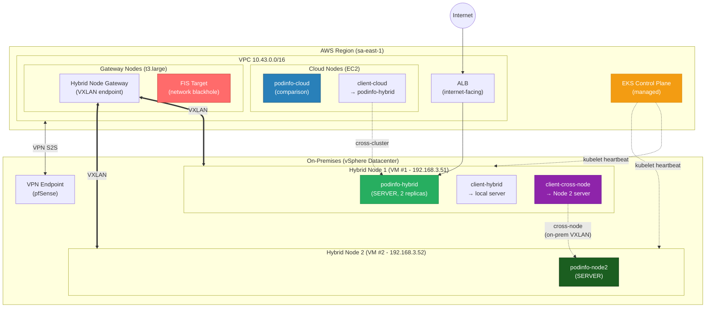
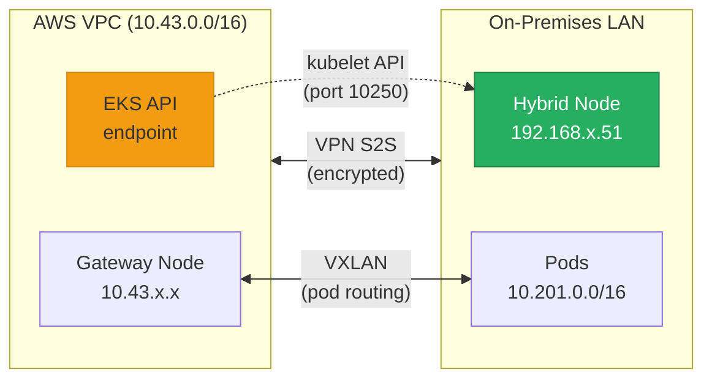

# EKS Hybrid Nodes - Resilience Demo

> Hands-on demonstration of workload resilience on EKS Hybrid Nodes during network disconnection scenarios between AWS and on-premises environments.

## Overview

This demo validates that workloads running on **EKS Hybrid Nodes** (on-premises) continue operating during network connectivity loss with the AWS region, using:

- **Kubernetes Tolerations** to prevent pod eviction during disconnection
- **AWS Fault Injection Service (FIS)** for controlled, auditable chaos engineering
- **vCenter/Hypervisor** interface toggle for visual, immediate network disruption
- **Application Load Balancer (ALB)** to validate ingress/egress traffic flows

## Architecture



### Network Topology



## Demo Scenarios

| # | Scenario | Fault Method | Expected Outcome | What It Proves |
|---|----------|--------------|------------------|----------------|
| 1 | Steady-state disconnect | FIS (network blackhole on Gateway Nodes) | Existing pods continue serving requests. Node transitions to NotReady after ~40s. Tolerations prevent eviction. | **"DC doesn't stop if AWS goes down"** |
| 1b | Multi-node on-prem communication | FIS (same as 1) | Pod on Hybrid Node 1 → Pod on Hybrid Node 2 continues working | **Production-like: microservices distributed across DC nodes** |
| 2 | Disconnect during provisioning | FIS + `kubectl scale` | New pods remain Pending (kube-api unreachable). Existing pods unaffected. | Known limitation - transparent trade-off |
| 3a | LB Region → Hybrid Nodes | ALB + curl | External traffic reaches on-prem pods via VXLAN tunnel | Ingress path validation |
| 3b | Hybrid Nodes → External | `kubectl exec` + curl | On-prem pods access external APIs | Egress path validation |

---

## Prerequisites

- AWS CLI v2 configured with credentials for the target account
- `kubectl` configured to access the EKS cluster
- Terraform >= 1.5
- Helm 3
- On-premises VM/bare metal with network connectivity to AWS (VPN or Direct Connect)

---

## Setup

### Path A: New Cluster (I don't have an EKS cluster with Hybrid Nodes yet)

<details>
<summary><b>Click to expand - Create an EKS cluster with Hybrid Nodes via eksctl</b></summary>

#### Step 1: Create the cluster with remote networking

```bash
cat <<'EOF' > cluster-config.yaml
apiVersion: eksctl.io/v1alpha5
kind: ClusterConfig

metadata:
  name: hybrid-resilience-demo
  region: sa-east-1
  version: "1.35"

# Enable Hybrid Nodes remote networking
remoteNetworkConfig:
  remoteNodeNetworks:
    - cidrs:
        - "192.168.3.0/24"   # Your on-premises node CIDR
  remotePodNetworks:
    - cidrs:
        - "10.201.0.0/16"    # CIDR for pods on hybrid nodes

managedNodeGroups:
  # Gateway Nodes - VXLAN endpoints for Hybrid Node Gateway
  - name: gateway-nodes
    instanceType: t3.large
    desiredCapacity: 2
    minSize: 2
    maxSize: 3
    labels:
      hybrid-gateway-node: "true"
    taints:
      - key: hybrid-gateway-node
        effect: NoSchedule

  # General-purpose cloud nodes
  - name: cloud-nodes
    instanceType: m6i.large
    desiredCapacity: 2
    minSize: 1
    maxSize: 4
EOF

eksctl create cluster -f cluster-config.yaml
```

#### Step 2: Install Cilium CNI

Hybrid Nodes require Cilium or Calico (VPC CNI doesn't support remote nodes).

```bash
helm repo add cilium https://helm.cilium.io/
helm install cilium cilium/cilium \
  --namespace kube-system \
  --set egressMasqueradeInterfaces=eth0 \
  --set routingMode=native \
  --set ipv4NativeRoutingCIDR="10.201.0.0/16" \
  --set tunnel=disabled \
  --set ipam.mode=cluster-pool \
  --set ipam.operator.clusterPoolIPv4PodCIDRList="{10.201.0.0/16}"
```

#### Step 3: Install Hybrid Node Gateway

The Gateway provides VXLAN tunneling for pod-to-pod communication between cloud and on-premises.

```bash
# Get your VPC route table IDs
RTB_IDS=$(aws ec2 describe-route-tables \
  --filters "Name=vpc-id,Values=$(aws eks describe-cluster \
    --name hybrid-resilience-demo --query 'cluster.resourcesVpcConfig.vpcId' --output text)" \
  --query 'RouteTables[].RouteTableId' --output text | tr '\t' ',')

helm install eks-hybrid-nodes-gateway \
  oci://public.ecr.aws/eks/eks-hybrid-nodes-gateway \
  --version 1.0.0 \
  --namespace eks-hybrid-nodes-gateway \
  --create-namespace \
  --set vpcCIDR="<YOUR_VPC_CIDR>" \
  --set podCIDRs="10.201.0.0/16" \
  --set routeTableIDs="${RTB_IDS}" \
  --set nodeSelector."hybrid-gateway-node"="true" \
  --set 'tolerations[0].key=hybrid-gateway-node' \
  --set 'tolerations[0].operator=Exists' \
  --set 'tolerations[0].effect=NoSchedule'
```

#### Step 4: Install AWS Load Balancer Controller

```bash
helm repo add eks https://aws.github.io/eks-charts
helm install aws-load-balancer-controller eks/aws-load-balancer-controller \
  --namespace kube-system \
  --set clusterName=hybrid-resilience-demo \
  --set region=sa-east-1 \
  --set vpcId=<YOUR_VPC_ID>
```

#### Step 5: Register the Hybrid Node

On the on-premises VM, install and configure `nodeadm`:

```bash
# 1. Create SSM Hybrid Activation (from your workstation)
aws ssm create-activation \
  --iam-role <HYBRID_NODE_ROLE_NAME> \
  --registration-limit 5 \
  --default-instance-name "hybrid-node" \
  --region sa-east-1

# 2. On the VM: install nodeadm
curl -Lo /usr/local/bin/nodeadm \
  "https://hybrid-assets.eks.amazonaws.com/releases/latest/bin/linux/amd64/nodeadm"
chmod +x /usr/local/bin/nodeadm

# 3. On the VM: create node config
cat <<EOF > /etc/nodeadm/nodeConfig.yaml
apiVersion: node.eks.aws/v1alpha1
kind: NodeConfig
spec:
  cluster:
    name: hybrid-resilience-demo
    region: sa-east-1
  hybrid:
    ssm:
      activationId: "<ACTIVATION_ID>"
      activationCode: "<ACTIVATION_CODE>"
EOF

# 4. On the VM: join the cluster
sudo nodeadm init --config /etc/nodeadm/nodeConfig.yaml
```

</details>

---

### Path B: Existing Cluster (I already have EKS with Hybrid Nodes)

#### Step 1: Configure kubectl

```bash
aws eks update-kubeconfig --name <CLUSTER_NAME> --region <REGION>
```

#### Step 2: Validate cluster state

```bash
# Check nodes - hybrid node should show with compute-type=hybrid
kubectl get nodes -o wide

# Verify hybrid node label
kubectl get nodes -l eks.amazonaws.com/compute-type=hybrid

# Verify Gateway is running
kubectl get pods -n eks-hybrid-nodes-gateway

# Verify AWS LB Controller
kubectl get pods -n kube-system -l app.kubernetes.io/name=aws-load-balancer-controller
```

#### Step 3: Run prerequisites check

```bash
chmod +x scripts/00-prerequisites.sh
./scripts/00-prerequisites.sh
```

---

## Deploy the Demo

### Step 1: Provision FIS Infrastructure (Terraform)

```bash
cd terraform/

# Initialize
terraform init

# Review what will be created
terraform plan \
  -var="cluster_name=<CLUSTER_NAME>" \
  -var="region=<REGION>" \
  -var="onprem_node_cidr=192.168.3.0/24" \
  -var="remote_pod_cidr=10.201.0.0/16"

# Apply
terraform apply \
  -var="cluster_name=<CLUSTER_NAME>" \
  -var="region=<REGION>" \
  -var="onprem_node_cidr=192.168.3.0/24" \
  -var="remote_pod_cidr=10.201.0.0/16"

# Note the outputs:
#   fis_experiment_template_id = "EXTxxxxxxxxxx"
#   ssm_document_name = "demo-stone-network-blackhole-cidr"
```

### Step 2: Deploy the Application

```bash
# Create namespace and deploy podinfo on hybrid nodes (with tolerations)
kubectl apply -f manifests/01-podinfo-hybrid.yaml

# Deploy podinfo on cloud nodes (for comparison)
kubectl apply -f manifests/02-podinfo-cloud.yaml

# Deploy continuous clients (TWO clients for different communication paths)
kubectl apply -f manifests/04-continuous-clients.yaml

# Verify all pods are running
kubectl get pods -n demo-stone -o wide

# Expected output - note WHERE each pod runs:
# NAME                         READY  STATUS   NODE                        ROLE
# podinfo-hybrid-xxxxx         1/1    Running  mi-0xxxxxxxxx (hybrid)      SERVER on-prem
# podinfo-hybrid-xxxxx         1/1    Running  mi-0xxxxxxxxx (hybrid)      SERVER on-prem
# podinfo-cloud-xxxxx          1/1    Running  ip-10-43-xx (cloud)         SERVER cloud
# podinfo-cloud-xxxxx          1/1    Running  ip-10-43-xx (cloud)         SERVER cloud
# client-hybrid-xxxxx          1/1    Running  mi-0xxxxxxxxx (hybrid)      CLIENT on-prem
# client-cloud-xxxxx           1/1    Running  ip-10-43-xx (cloud)         CLIENT cloud
# curl-cloud                   1/1    Running  ip-10-43-xx (cloud)         utility

# Verify both clients are producing logs
echo "=== client-hybrid (local) ==="
kubectl logs -n demo-stone deploy/client-hybrid --tail=3

echo "=== client-cloud (cross-cluster) ==="
kubectl logs -n demo-stone deploy/client-cloud --tail=3
```

**Pod topology:**

```
┌─ On-Premises (Hybrid Node) ────────────────────────────────────────────┐
│                                                                        │
│  [podinfo-hybrid] ← SERVER (2 replicas)                                │
│  [client-hybrid]  ← CLIENT (calls podinfo-hybrid every 5s)             │
│                                                                        │
│  Path: LOCAL pod-to-pod (same node, Cilium eBPF datapath)              │
│  During disconnect: ✓ CONTINUES (never fails)                          │
└────────────────────────────────────────────────────────────────────────┘

┌─ AWS Cloud (EC2 Nodes) ────────────────────────────────────────────────┐
│                                                                        │
│  [podinfo-cloud]  ← SERVER (2 replicas, for comparison/LB tests)       │
│  [client-cloud]   ← CLIENT (calls podinfo-hybrid on-prem every 5s)     │
│                                                                        │
│  Path: CROSS-CLUSTER (cloud → VXLAN Gateway → on-prem)                 │
│  During disconnect: ✗ TIMEOUT (link down - expected)                   │
│  After recovery: ✓ AUTO-HEALS (no manual intervention)                 │
└────────────────────────────────────────────────────────────────────────┘
```

### Step 3: Create ALB Ingress

```bash
# Deploy the ALB ingress
kubectl apply -f manifests/03-ingress-alb.yaml

# Wait for ALB to provision (~2-3 minutes)
echo "Waiting for ALB..."
kubectl wait --for=jsonpath='{.status.loadBalancer.ingress[0].hostname}' \
  ingress/podinfo-ingress -n demo-stone --timeout=180s

# Get the ALB DNS
ALB=$(kubectl get ingress podinfo-ingress -n demo-stone \
  -o jsonpath='{.status.loadBalancer.ingress[0].hostname}')
echo "ALB ready: http://${ALB}/"

# Test it
curl -s "http://${ALB}/" | jq '{hostname, message}'
```

### Step 4: Deploy Cross-Node Communication Test (requires 2 hybrid nodes)

This is the closest to production: microservices distributed across multiple on-prem nodes, communicating via Cilium VXLAN mesh independently of AWS.

```bash
# Prerequisites: TWO hybrid nodes registered in the cluster.
# If you only have one, clone the VM in vCenter and register the second:
#   1. Clone the existing hybrid node VM in vCenter
#   2. Set a different IP (e.g., 192.168.3.52, same /24 subnet)
#   3. On the new VM: sudo nodeadm init --config nodeConfig.yaml
#   4. Wait for it to join: kubectl get nodes -l eks.amazonaws.com/compute-type=hybrid

# Label the nodes to differentiate them
kubectl label node <FIRST_HYBRID_NODE> hybrid-node-id=node1
kubectl label node <SECOND_HYBRID_NODE> hybrid-node-id=node2

# Deploy the cross-node test (server on node2, client on node1)
kubectl apply -f manifests/05-cross-hybrid-nodes.yaml

# Verify placement
kubectl get pods -n demo-stone -l demo=hybrid-resilience -o wide | grep -E "node2|cross-node"
# NAME                           READY  STATUS   NODE
# podinfo-node2-xxxxx            1/1    Running  mi-YYYYYYYY (node2)
# client-cross-node-xxxxx        1/1    Running  mi-XXXXXXXX (node1)

# Verify cross-node communication works
kubectl logs -n demo-stone deploy/client-cross-node --tail=5
# [09:15:10] #1 → podinfo-node2 | STATUS=200 ✓ cross-node OK
# [09:15:15] #2 → podinfo-node2 | STATUS=200 ✓ cross-node OK
```

**Updated pod topology with 2 hybrid nodes:**

```
┌─ Hybrid Node 1 (vSphere VM #1, 192.168.3.51) ──────────────────────┐
│                                                                      │
│  [podinfo-hybrid]    ← SERVER (2 replicas)                           │
│  [client-hybrid]     ← CLIENT → podinfo-hybrid (local, same node)   │
│  [client-cross-node] ← CLIENT → podinfo-node2 (cross-node, Node 2)  │
│                                                                      │
└──────────────────────────────────────────────────────────────────────┘
            │                                    ▲
            │        Cilium VXLAN (on-prem)       │
            ▼                                    │
┌─ Hybrid Node 2 (vSphere VM #2, 192.168.3.52) ──────────────────────┐
│                                                                      │
│  [podinfo-node2]     ← SERVER (target for cross-node test)           │
│                                                                      │
└──────────────────────────────────────────────────────────────────────┘

┌─ AWS Cloud (EC2 Nodes) ─────────────────────────────────────────────┐
│                                                                      │
│  [podinfo-cloud]     ← SERVER (comparison)                           │
│  [client-cloud]      ← CLIENT → podinfo-hybrid (cross-cluster)      │
│                                                                      │
└──────────────────────────────────────────────────────────────────────┘
```

### Step 5: Run the Demo

```bash
chmod +x scripts/demo-live.sh
./scripts/demo-live.sh
```

---

## Execution Guide (Step-by-Step for Live Demo)

> This section documents exactly what happens during the demo, with commentary
> for presenting to the customer. The interactive script (`scripts/demo-live.sh`)
> automates these steps with pauses for explanation.

### Phase 1: Show Current State (5 min)

**What to show the customer:**

1. **Nodes in the cluster** - point out the hybrid node (different hostname pattern `mi-xxxx`, different OS, different IP range):
   ```bash
   kubectl get nodes -o wide
   ```

2. **Pods running on BOTH sides** - color-coded (green = on-prem, blue = cloud):
   ```bash
   kubectl get pods -n demo-stone -o wide
   ```

3. **Tolerations configured** - explain WHY they exist:
   ```bash
   kubectl get deploy podinfo-hybrid -n demo-stone -o yaml | grep -A 10 tolerations
   ```

4. **Key talking point:**
   > "These tolerations tell Kubernetes: even if this node becomes unreachable,
   > do NOT evict the pods. They should keep running indefinitely (or for N hours).
   > Without this, Kubernetes would evict pods after 5 minutes by default."

---

### Phase 2: LB Tests - Happy Path (10 min)

#### 2a. Region → Hybrid Nodes (Ingress)

**What to show:**

```bash
# External traffic reaches the on-prem pods
ALB=$(kubectl get ingress podinfo-ingress -n demo-stone -o jsonpath='{.status.loadBalancer.ingress[0].hostname}')

# Single request - note the "message" field showing it's the hybrid pod
curl -s "http://${ALB}/" | jq '{hostname, message, color}'

# Multiple requests - show distribution
for i in $(seq 1 5); do
  echo "Request $i: $(curl -s http://${ALB}/ | jq -r '.hostname')"
done
```

**Talking point:**
> "Traffic from the internet hits the ALB in the AWS region,
> which routes to the pod running on-premises via the VXLAN tunnel.
> This validates your ingress path works end-to-end."

#### 2b. Hybrid Nodes → External (Egress)

**What to show:**

```bash
# Pod on-prem calling an external API
kubectl exec -n demo-stone deploy/podinfo-hybrid -- curl -s httpbin.org/ip

# Pod on-prem calling a service in the cloud (cross-cluster)
kubectl exec -n demo-stone deploy/podinfo-hybrid -- \
  curl -s http://podinfo-cloud.demo-stone:9898/ | jq '{hostname, message}'
```

**Talking point:**
> "Pods on-prem can reach external APIs and also communicate
> with pods in the cloud region. Bidirectional connectivity is working."

---

### Phase 3: Disconnect - Steady State (10 min)

**This is the core of the demo.**

#### Step 1: Open two terminals with continuous client logs (side by side)

```bash
# Terminal 1: LOCAL client (hybrid → hybrid, same node)
kubectl logs -n demo-stone deploy/client-hybrid -f

# Terminal 2: CROSS-CLUSTER client (cloud → hybrid, over VXLAN)
kubectl logs -n demo-stone deploy/client-cloud -f
```

Both show STATUS=200 before disconnect. The contrast AFTER disconnect is the proof.

#### Step 2: Start the FIS experiment

```bash
# Option A: FIS (recommended - shows the AWS service)
FIS_TEMPLATE_ID="<from terraform output>"
aws fis start-experiment \
  --experiment-template-id ${FIS_TEMPLATE_ID} \
  --region sa-east-1

# Option B: vCenter (visual fallback)
# In vCenter UI: VM → Edit Settings → Network Adapter 1 → Disconnect
```

#### Step 3: Watch the contrast between both clients

After ~40 seconds, the customer sees:

```
# Terminal 1 (client-hybrid - LOCAL):
[09:20:10] #120 → podinfo-hybrid | STATUS=200 ✓ processing
[09:20:15] #121 → podinfo-hybrid | STATUS=200 ✓ processing    ← UNINTERRUPTED
[09:20:20] #122 → podinfo-hybrid | STATUS=200 ✓ processing
[09:20:25] #123 → podinfo-hybrid | STATUS=200 ✓ processing

# Terminal 2 (client-cloud - CROSS-CLUSTER):
[09:20:10] #120 → podinfo-hybrid | STATUS=200 ✓ cross-cluster OK
[09:20:15] #121 → podinfo-hybrid | STATUS=TIMEOUT ✗ link down  ← EXPECTED
[09:20:20] #122 → podinfo-hybrid | STATUS=TIMEOUT ✗ link down
[09:20:25] #123 → podinfo-hybrid | STATUS=TIMEOUT ✗ link down
```

#### Step 4: Show node status

```bash
# Node is NotReady (no heartbeat to control plane)
kubectl get nodes -l eks.amazonaws.com/compute-type=hybrid
# NAME                    STATUS     ROLES   AGE
# mi-0ee2ff775b4369c29    NotReady   <none>  40d

# BUT pods remain Running (tolerations prevent eviction)
kubectl get pods -n demo-stone -l tier=hybrid -o wide
# podinfo-hybrid-xxxxx   1/1   Running   mi-0ee2ff775b4369c29
# podinfo-hybrid-xxxxx   1/1   Running   mi-0ee2ff775b4369c29
# client-hybrid-xxxxx    1/1   Running   mi-0ee2ff775b4369c29
```

**Key talking points:**
- **client-hybrid (local):** STATUS=200 continuously - pods PROCESS requests without interruption
- **client-cloud (cross-cluster):** TIMEOUT - expected because the VXLAN tunnel traverses the broken link
- This proves exactly what the customer needs: **workloads on-premises continue operating even if AWS connectivity is lost**
- The cross-cluster path failing is expected and acceptable - the DATACENTER is independent
- Pod-to-pod on the same node uses Cilium eBPF datapath (kernel-level, no control plane dependency)

---

### Phase 3b: Multi-Node On-Premises Communication During Disconnect (5 min)

**The production scenario: microservices distributed across multiple DC nodes.**

#### Step 1: Show cross-node client (Hybrid Node 1 → Hybrid Node 2)

```bash
# This client runs on Node 1 and calls a server on Node 2
# Both are on-premises, communication via Cilium VXLAN over the local LAN
kubectl logs -n demo-stone deploy/client-cross-node --tail=5
```

**What the customer sees:**

```
# DURING AWS DISCONNECT:
[09:22:10] #150 → podinfo-node2 | STATUS=200 ✓ cross-node OK
[09:22:15] #151 → podinfo-node2 | STATUS=200 ✓ cross-node OK
[09:22:20] #152 → podinfo-node2 | STATUS=200 ✓ cross-node OK
```

#### Step 2: Summary of all THREE communication paths

```bash
echo "=== LOCAL (Node 1 → Node 1): ==="
kubectl logs -n demo-stone deploy/client-hybrid --tail=2

echo "=== CROSS-NODE (Node 1 → Node 2, on-prem): ==="
kubectl logs -n demo-stone deploy/client-cross-node --tail=2

echo "=== CROSS-CLUSTER (Cloud → Node 1, over VPN): ==="
kubectl logs -n demo-stone deploy/client-cloud --tail=2
```

**Expected results during disconnect:**

| Path | Status | Why |
|------|--------|-----|
| client-hybrid (same node) | ✓ STATUS=200 | Cilium eBPF datapath, local |
| client-cross-node (Node 1 → Node 2) | ✓ STATUS=200 | Cilium VXLAN over local LAN, independent of AWS |
| client-cloud (Cloud → Node 1) | ✗ TIMEOUT | Path traverses the broken VPN link |

**Key talking point:**
> "This is the production scenario. Your microservices will be distributed
> across multiple nodes in the datacenter. This test proves that
> even cross-node communication within the DC continues working
> during an AWS disconnection. The Cilium overlay mesh between
> on-premises nodes is LOCAL - it doesn't depend on the control plane.
> Only the initial setup needs the control plane. Once running,
> the datapath is autonomous."

---

### Phase 4: Disconnect During Provisioning (10 min)

**While still disconnected. client-hybrid still logging 200s.**

#### Step 1: Show both clients (client-hybrid still 200, client-cloud still TIMEOUT)

```bash
echo "=== LOCAL (hybrid→hybrid): still processing ==="
kubectl logs -n demo-stone deploy/client-hybrid --tail=3

echo "=== CROSS-CLUSTER (cloud→hybrid): still broken (expected) ==="
kubectl logs -n demo-stone deploy/client-cloud --tail=3
```

#### Step 2: Attempt to scale

```bash
# Try to add 2 more replicas
kubectl scale deploy podinfo-hybrid -n demo-stone --replicas=4
```

#### Step 3: Observe the result (wait 15 seconds)

```bash
kubectl get pods -n demo-stone -l tier=hybrid -o wide
# NAME                         READY  STATUS   NODE
# podinfo-hybrid-xxxxx         1/1    Running  mi-0ee2ff775b4369c29   ← existing
# podinfo-hybrid-xxxxx         1/1    Running  mi-0ee2ff775b4369c29   ← existing
# podinfo-hybrid-yyyyy         0/1    Pending  <none>                 ← NEW, can't schedule
# podinfo-hybrid-zzzzz         0/1    Pending  <none>                 ← NEW, can't schedule
# client-hybrid-xxxxx          1/1    Running  mi-0ee2ff775b4369c29   ← still processing!
```

#### Step 4: Prove existing pods still process

```bash
# client-hybrid STILL getting 200s throughout this entire test
kubectl logs -n demo-stone deploy/client-hybrid --tail=3
# [09:25:10] #180 → podinfo-hybrid | STATUS=200 ✓ processing
# [09:25:15] #181 → podinfo-hybrid | STATUS=200 ✓ processing
# [09:25:20] #182 → podinfo-hybrid | STATUS=200 ✓ processing
```

**Key talking points:**
- Existing pods (2 Running + client-hybrid): **still actively processing** (proven by logs)
- New pods: Pending - scheduler can't reach the hybrid node
- This is a **control plane limitation**, NOT a workload limitation
- Mitigation: pre-size replicas for expected disconnection load (N+1 or N+2)
- The continuous logs are undeniable proof that existing work is uninterrupted

---

### Phase 5: Recovery (5 min)

```bash
# Stop FIS experiment (auto-stops after duration), OR
# Reconnect the network adapter in vCenter

# Watch recovery in both client terminals:
# Terminal 1 (client-hybrid): was 200 throughout, stays 200
# Terminal 2 (client-cloud): was TIMEOUT, transitions back to 200
```

**What the customer sees in client-cloud terminal (the "aha" moment):**

```
[09:30:15] #240 → podinfo-hybrid | STATUS=TIMEOUT ✗ link down
[09:30:20] #241 → podinfo-hybrid | STATUS=TIMEOUT ✗ link down
[09:30:25] #242 → podinfo-hybrid | STATUS=200 ✓ cross-cluster OK    ← AUTO-HEALED!
[09:30:30] #243 → podinfo-hybrid | STATUS=200 ✓ cross-cluster OK
```

```bash
# Node transitions back to Ready
kubectl get nodes -l eks.amazonaws.com/compute-type=hybrid
# NAME                    STATUS   ROLES   AGE
# mi-0ee2ff775b4369c29    Ready    <none>  40d

# Pending pods get scheduled
kubectl get pods -n demo-stone -l tier=hybrid -o wide
# All 4 replicas now Running

# Scale back to normal
kubectl scale deploy podinfo-hybrid -n demo-stone --replicas=2
```

**Key talking points:**
- Recovery is **automatic** - zero manual intervention
- client-hybrid: never had a single failure (local path independent)
- client-cloud: auto-heals the moment connectivity is restored
- Pending pods get scheduled immediately
- Full cluster reconciliation, zero data loss

---

## Key Concepts: Tolerations

```yaml
tolerations:
  # When node is unreachable, controller-manager adds this taint.
  # Default behavior (no toleration): pods evicted after 300s.
  # With toleration + tolerationSeconds: pods survive for N seconds.
  # With toleration WITHOUT tolerationSeconds: pods survive INDEFINITELY.
  - key: "node.kubernetes.io/unreachable"
    operator: "Exists"
    effect: "NoExecute"
    tolerationSeconds: 3600  # 1h for demo. Production: omit entirely.

  - key: "node.kubernetes.io/not-ready"
    operator: "Exists"
    effect: "NoExecute"
    tolerationSeconds: 3600
```

### Production Recommendations

| Parameter | Demo | Production |
|-----------|------|------------|
| `tolerationSeconds` | 3600 (1h) | Omit (indefinite) or 86400 (24h) |
| Replicas | 2 | N+2 (absorb load during disconnect) |
| Zone labels | - | Assign `topology.kubernetes.io/zone` per DC |
| Local LB | ALB (demo) | MetalLB L2 or F5 (stable during disconnect) |
| Monitoring | kubectl events | Local Prometheus + ADOT dual-backend |
| Troubleshooting | kubectl | `crictl` (works without control plane) |

---

## Credential Behavior During Disconnection

| Credential Provider | Token Validity | Behavior During Disconnect | Reconnection |
|--------------------|---------------|---------------------------|--------------|
| **SSM Hybrid Activation** | 1 hour (fixed, not configurable) | SSM agent cannot refresh token. Exponential backoff retries (capped at 30min intervals). | May take up to 30min after network restores. Restart SSM agent to force immediate refresh. |
| **IAM Roles Anywhere** | 1 hour (default), up to **12 hours** (configurable via `durationSeconds`) | Credential valid for configured duration without needing network. | Reconnects within seconds of network restoration (`aws_signing_helper credential-process` fetches on-demand). |

**Recommendation:** If maximum disconnection tolerance is required, use **IAM Roles Anywhere** configured with `durationSeconds: 43200` (12 hours). This provides the longest offline window without credential expiry.

> **Source:** [EKS Best Practices - Host Credentials Through Network Disconnections](https://docs.aws.amazon.com/eks/latest/best-practices/hybrid-nodes-host-creds.html)

---

## Known Limitations

| Limitation | Impact | Mitigation |
|-----------|--------|------------|
| Control plane in AWS Region | New scheduling, scaling, rollouts unavailable during disconnect | Pre-size replicas for expected disconnection load |
| Cilium agent restarts during disconnect | BGP sessions may drop (Cilium health coupled to kube-api). Improvement opt-in in Cilium v1.17+ ([#31702](https://github.com/cilium/cilium/issues/31702)) | Use MetalLB L2 for on-prem LB (stable during disconnect), or Cilium v1.17+ with the fix |
| ALB/NLB for region-originated traffic | Traffic down during connectivity loss | Local LB (MetalLB, F5) for DC-local traffic |
| Image pulls (ECR) | New pods can't pull images during disconnect | Pre-pull images, or use local registry mirror |
| DNS resolution | CoreDNS queries to upstream may fail | Configure `dnsPolicy: None` with local DNS as fallback |

> **Source:** [EKS Best Practices - Network Disconnections](https://docs.aws.amazon.com/eks/latest/best-practices/hybrid-nodes-network-disconnections.html)

---

## Fault Injection Strategy

### Method 1: AWS FIS + Custom SSM Document (AWS-side disruption)

The Terraform in this repo creates a custom SSM document that uses iptables to block traffic to specific CIDRs, simulating a network link failure from the AWS side. This is more realistic than port-based blackhole for this use case.

```bash
# Start the experiment
aws fis start-experiment \
  --experiment-template-id <TEMPLATE_ID> \
  --region <REGION>

# Monitor experiment status
aws fis get-experiment --id <EXPERIMENT_ID> --region <REGION> \
  --query 'experiment.state.{status:status,reason:reason}'

# FIS auto-reverts after the configured duration (default: 5 minutes)
```

### Method 2: vCenter/Hypervisor (DC-side disruption)

For visual, immediate impact during live demos:

| Hypervisor | Action | Revert |
|-----------|--------|--------|
| **vSphere/vCenter** | VM → Edit Settings → Network Adapter → Disconnect | Reconnect checkbox |
| **KVM/libvirt** | `virsh domif-setlink <vm> <nic> down` | `virsh domif-setlink <vm> <nic> up` |
| **Hyper-V** | Disconnect network adapter in Settings | Reconnect |

### Combined Approach (Recommended for Demo)

1. **Phase 3 (steady-state):** Use FIS - shows the AWS service, enterprise-grade, auditable
2. **Recovery:** Let FIS auto-revert (demonstrates automatic rollback)
3. **Ad-hoc tests:** Use vCenter toggle for instant, visual network disruption

---

## Cleanup

```bash
# Remove K8s resources
kubectl delete ns demo-stone

# Remove FIS infrastructure
cd terraform/
terraform destroy

# Optional: scale down gateway nodes to save cost
aws eks update-nodegroup-config \
  --cluster-name <CLUSTER_NAME> \
  --nodegroup-name <GATEWAY_NG_NAME> \
  --scaling-config minSize=0,maxSize=2,desiredSize=0 \
  --region <REGION>
```

---

## References

- [EKS Hybrid Nodes - Network Disconnections (Best Practices)](https://docs.aws.amazon.com/eks/latest/best-practices/hybrid-nodes-network-disconnections.html)
- [EKS Hybrid Nodes - Host Credentials](https://docs.aws.amazon.com/eks/latest/best-practices/hybrid-nodes-host-creds.html)
- [EKS Hybrid Nodes - Pod Failover Behavior](https://docs.aws.amazon.com/eks/latest/best-practices/hybrid-nodes-kubernetes-pod-failover.html)
- [EKS Hybrid Nodes - Overview](https://docs.aws.amazon.com/eks/latest/userguide/hybrid-nodes-overview.html)
- [Hybrid Node Gateway](https://docs.aws.amazon.com/eks/latest/userguide/hybrid-nodes-gateway.html)
- [AWS FIS - SSM Actions](https://docs.aws.amazon.com/fis/latest/userguide/actions-ssm-agent.html)
- [Kubernetes Taints and Tolerations](https://kubernetes.io/docs/concepts/scheduling-eviction/taint-and-toleration/)
- [aws-samples/eks-hybrid-examples (GitHub)](https://github.com/aws-samples/eks-hybrid-examples)
- [Podinfo (demo app)](https://github.com/stefanprodan/podinfo)

---

## Repository Structure

```
eks-hybrid-resilience-demo/
├── README.md                           # This document (full execution guide)
├── manifests/
│   ├── 01-podinfo-hybrid.yaml          # SERVER on Hybrid Node 1 (with tolerations)
│   ├── 02-podinfo-cloud.yaml           # SERVER on Cloud Nodes (comparison)
│   ├── 03-ingress-alb.yaml            # ALB Ingress configuration
│   ├── 04-continuous-clients.yaml      # CLIENTS: hybrid (local) + cloud (cross-cluster)
│   └── 05-cross-hybrid-nodes.yaml      # SERVER on Node 2 + CLIENT cross-node (Node1→Node2)
├── terraform/
│   └── main.tf                         # FIS role, custom SSM document, experiment template
└── scripts/
    ├── 00-prerequisites.sh             # Validate cluster readiness
    └── demo-live.sh                    # Interactive demo script (customer-facing)
```
