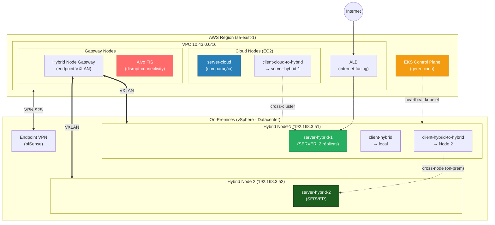

Este documento cobre TODA a preparação do ambiente, feita **antes** da call com
o cliente. Ao final, o ambiente estará validado e pronto para a demo ao vivo
(que está na Parte 2 - Demo Runbook).

::alert[Nada aqui é apresentado ao cliente. É o trabalho de bastidor. A demo ao vivo começa na Parte 2.]{type="info"}

## Visão geral da demo

Demonstração de resiliência de workloads em EKS Hybrid Nodes durante cenários de
desconexão de rede entre a AWS e o ambiente on-premises. Prova que workloads
rodando on-prem continuam operando mesmo quando a conectividade com a região AWS
é perdida, usando:

- **Tolerations** do Kubernetes para evitar eviction dos pods durante desconexão
- **AWS Fault Injection Service (FIS)** para injeção de falha controlada e auditável
- **vCenter** para desconexão visual e imediata da interface de rede
- **Application Load Balancer (ALB)** e **MetalLB** para validar os fluxos de tráfego

## Arquitetura

## Convenção de nomes dos Pods

Os nomes são desenhados para que `kubectl get pods` já diga ONDE roda e O QUE faz:

| Nome do Pod | Localização | Papel | Chama |
|-------------|-------------|-------|-------|
| **server-hybrid-1** | Hybrid Node 1 (on-prem) | Server | - |
| **server-hybrid-2** | Hybrid Node 2 (on-prem) | Server | - |
| **server-cloud** | Amazon EKS (Região AWS) | Server | - |
| **client-hybrid** | Hybrid Node 1 (on-prem) | Client | → server-hybrid-1 (local) |
| **client-hybrid-to-hybrid** | Hybrid Node 1 (on-prem) | Client | → server-hybrid-2 (cross-node) |
| **client-cloud-to-hybrid** | Amazon EKS (Região AWS) | Client | → server-hybrid-1 (cross-cluster) |

Padrão: `{papel}-{localização}[-to-{alvo}]`

## Topologia de rede (adapte ao seu ambiente)

Preencha com os valores do SEU ambiente on-premises: LAN dos hybrid nodes
(RemoteNodeNetwork), CIDR dos pods (RemotePodNetwork), pool de VIPs do MetalLB
(IPs livres na LAN) e o método de conectividade com a AWS (VPN/Direct Connect).

## Pré-requisitos

- AWS CLI v2 + isengardcli (conta DevOps 923739522526)
- kubectl, Helm 3, Terraform >= 1.5
- Cluster EKS `llm-vmware-hybrid` (sa-east-1) com Hybrid Nodes já configurado

Configurar o kubectl:

:::code{showCopyAction=true showLineNumbers=false language=bash}
aws eks update-kubeconfig --name llm-vmware-hybrid --region sa-east-1
:::

## Setup - Passo 1: Validar pré-requisitos

:::code{showCopyAction=true showLineNumbers=false language=bash}
chmod +x scripts/00-prerequisites.sh
./scripts/00-prerequisites.sh
:::

O script valida: kubectl, node hybrid Ready, Hybrid Node Gateway, AWS LB
Controller, Cilium, VPN (com detecção automática de IP público divergente).

## Setup - Passo 2: Rotular os Hybrid Nodes

Os manifests usam `nodeSelector: hybrid-node-id`. Rotular ANTES de fazer deploy:

:::code{showCopyAction=true showLineNumbers=false language=bash}
kubectl get nodes -l eks.amazonaws.com/compute-type=hybrid
kubectl label node <NODE_1> hybrid-node-id=node1
:::

## Setup - Passo 3: Provisionar a infra do FIS (Terraform)

:::code{showCopyAction=true showLineNumbers=false language=bash}
cd terraform/
terraform init
terraform apply \
  -var="cluster_name=llm-vmware-hybrid" \
  -var="region=sa-east-1" \
  -var="onprem_node_cidr=192.168.3.0/24" \
  -var="remote_pod_cidr=10.201.0.0/16"
:::

Anote o output `fis_experiment_template_id` - será usado nos cenários de falha.

## Setup - Passo 4: Deploy dos servers e clients

:::code{showCopyAction=true showLineNumbers=false language=bash}
kubectl apply -f manifests/01-server-hybrid-1.yaml   # server on-prem Node 1
kubectl apply -f manifests/03-server-cloud.yaml      # server cloud
kubectl apply -f manifests/04-clients.yaml           # 3 clients
kubectl get pods -n demo-stone -o wide
:::

## Setup - Passo 5: MetalLB (LB on-premises)

MetalLB em modo L2 é o padrão validado pela AWS para estabilidade durante
desconexões. Fornece o VIP local (papel análogo ao F5 no design de produção).

:::code{showCopyAction=true showLineNumbers=false language=bash}
helm repo add metallb https://metallb.github.io/metallb
helm repo update
helm install metallb metallb/metallb \
  --namespace metallb-system --create-namespace \
  --set 'speaker.tolerations[0].key=node.kubernetes.io/unreachable' \
  --set 'speaker.tolerations[0].operator=Exists' \
  --set 'speaker.tolerations[0].effect=NoExecute'

kubectl apply -f manifests/06-metallb-onprem-lb.yaml
kubectl get svc server-hybrid-lb -n demo-stone
:::

## Setup - Passo 6: ALB Ingress

:::code{showCopyAction=true showLineNumbers=false language=bash}
kubectl apply -f manifests/05-ingress-alb.yaml
kubectl wait --for=jsonpath='{.status.loadBalancer.ingress[0].hostname}' \
  ingress/demo-ingress -n demo-stone --timeout=180s
:::

::alert[O ALB com target-type ip precisa que o security group do cluster/nodes permita o SG do ALB na porta 9898, e que as subnets do ALB tenham rota para o pod CIDR (10.201.0.0/16). Ver troubleshooting em environment-status.]{type="warning"}

## Setup - Passo 7: Validar tudo (dry-run)

Antes da call, rode o validador para confirmar que cada cenário funciona
end-to-end, e depois o RESET para deixar o ambiente no baseline limpo:

:::code{showCopyAction=true showLineNumbers=false language=bash}
export FIS_TEMPLATE_ID=<id do terraform output>
chmod +x scripts/validate-demo.sh
./scripts/validate-demo.sh        # menu interativo - opção A roda tudo + reset
:::

::alert[O validate-demo.sh NÃO é usado na demo ao vivo. Ele só valida o ambiente. A demo é apresentada passo a passo pela Parte 2 (Demo Runbook), você mostrando cada comando. O validador só faz operações reversíveis e a opção RESET garante baseline limpo.]{type="info"}

## Nota: segundo Hybrid Node

Adicionar o Node 2 é **prep**, não passo da demo. Ver `setup-vm2.md`. É necessário
apenas para o cenário cross-node (Node1→Node2).
